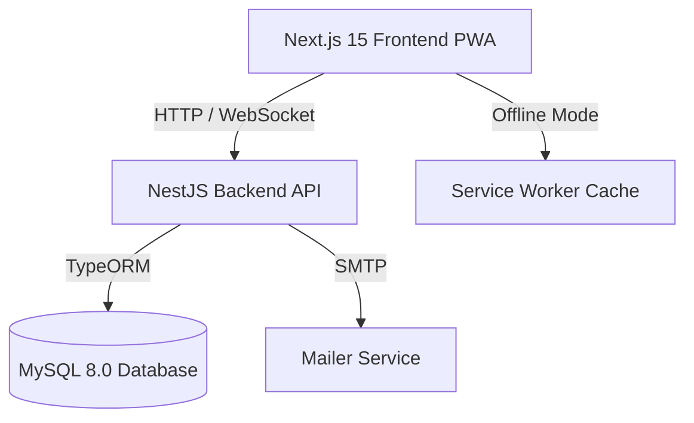

# Foodies Express - Production-Grade Food Ordering Platform

Foodies Express is a production-grade, highly optimized, accessible, secure, and SEO-friendly food ordering platform inspired by global pizza delivery platforms like Pizza Hut. Built as a full-stack JavaScript application leveraging **Next.js 15**, **NestJS**, **MySQL (TypeORM)**, and **Progressive Web App (PWA)** capabilities.

---

## 1. Project Overview & Architecture

The platform follows a decoupled client-server architecture. All dynamic data (menu items, cart modifications, orders, reviews, user profiles, dashboard metrics) is queried through REST API endpoints and live WebSocket connections.



### Decoupled Subprojects:
- **Frontend (`/frontend`)**: A Next.js 15 App Router application optimized for SEO and accessibility (WCAG compliance, ARIA markup).
- **Backend (`/backend`)**: A modular NestJS application structuring REST controllers and services. Enforces global exception filters, CORS, input validation pipes, and Swagger documentation.

---

## 2. Technology Stack

- **Frontend Core**: Next.js 15.5.20, React 19.1.0, TailwindCSS 4, Framer Motion 12.4.2
- **Frontend State**: Zustand 5.0.14
- **Backend Core**: NestJS 11.0.1, Express, Passport JWT, TypeORM 0.3.30
- **Database**: MySQL 8.0 (MySQL2 driver)
- **Emailing**: Nodemailer 9.0.3
- **Tooling**: TypeScript 5, Prettier 3, ESLint 9, Husky 9

---

## 3. Features

- 🍕 **Gourmet Pizza Customizer**: Adjust sizes, select crust types, toggle extra mozzarella, and add individual custom toppings.
- 📦 **Interactive Combo Builder**: Drag-and-drop or select items to construct custom meal platters.
- ⚡ **Progressive Web App (PWA)**: Register service worker, implement custom offline layouts, cache assets, and display PWA installation prompts.
- 🔍 **Global Autocomplete Search**: Highly responsive search modal highlighting matching queries, listing popular keywords, and caching recent searches.
- 🎛️ **Advanced Filters**: Filter pizzas and sides by Price limit, Veg/Non-Veg, average Customer Rating, Stock Availability, and Special Offers.
- 📬 **Transactional Mailer**: Custom table-based HTML email templates for OTP registration, logins, and order updates (highly compatible with Outlook/Gmail).
- 🔒 **Security Measures**:
  - Encrypted Password storage using `bcrypt`.
  - CSRF-safe Authorization headers using Passport JWT.
  - Custom IP Rate-Limiting middleware globally applied.
  - Role-Based Access Control guards (`RolesGuard`) for administrative endpoints.
- 📊 **Admin Dashboard**: Live order dispatch screens, CMS managers, coupon editors, visual analytics charts, and inline input validations.

---

## 4. Folder Structure

```
food-ordering-platform/
├── backend/                   # NestJS Server Application
│   ├── src/
│   │   ├── common/            # Custom global middlewares (Rate Limiting)
│   │   ├── config/            # Environment configurations & validation schemas
│   │   ├── database/          # Database connection module
│   │   └── modules/
│   │       ├── auth/          # Authentications (JWT, OTP code generation, Mailer)
│   │       ├── users/         # Customer profiles & roles
│   │       ├── products/      # Food catalogs & name slug endpoints
│   │       └── orders/        # Checkout and order managers
├── frontend/                  # Next.js 15 Client PWA
│   ├── public/                # Static assets, icons, browserconfigs, sw.js
│   ├── src/
│   │   ├── app/               # Server/Client routes & dynamic sitemaps/robots
│   │   ├── components/        # Dialogs, Search, Navbars, Error boundaries
│   │   ├── store/             # Zustand Cart, Auth and Toast states
│   │   └── types/             # TypeScript contract types
├── docker-compose.yml         # Database infrastructure (MySQL & Adminer)
└── package.json               # Root workspace script definitions
```

---

## 5. Environment Variables

### Backend Configuration (`/backend/.env`)
```ini
PORT=4000
NODE_ENV=production

# Database Settings
DB_HOST=localhost
DB_PORT=3306
DB_USERNAME=dbuser
DB_PASSWORD=dbpassword
DB_DATABASE=food_platform

# JWT Secret
JWT_SECRET=super-secure-jwt-secret-key-pizza-hut
JWT_EXPIRATION_TIME=1d

# SMTP Email Settings
SMTP_HOST=smtp.mailtrap.io
SMTP_PORT=587
SMTP_USER=your_smtp_username
SMTP_PASS=your_smtp_password
SMTP_FROM=no-reply@foodies-express.com
```

### Frontend Configuration (`/frontend/.env.local`)
```ini
NEXT_PUBLIC_API_URL=http://localhost:4000/api
```

---

## 6. Installation & Database Setup

1. **Install Root Workspaces Dependencies**:
   ```bash
   npm install
   ```

2. **Boot Database Infrastructure**:
   Ensure Docker is running and launch the MySQL container:
   ```bash
   docker compose up -d
   ```
   *Note: Adminer is available on `http://localhost:8080` for visual database inspection.*

3. **Start Development Servers**:
   ```bash
   # Run both apps in parallel
   npm run dev:frontend
   npm run dev:backend
   ```
   - Client Portal: `http://localhost:3000`
   - Server swagger API Documentation: `http://localhost:4000/api/docs`

---

## 7. SMTP Setup

To enable transaction mailers (sending registration code or order updates):
1. Obtain credentials from an SMTP email service (e.g. Mailtrap for development or SendGrid for production).
2. Configure `SMTP_HOST`, `SMTP_PORT`, `SMTP_USER`, and `SMTP_PASS` in your backend `.env` file.
3. If SMTP variables are missing, the server falls back to logging OTP codes directly to the terminal console to avoid interruptions.

---

## 8. Deployment

### Frontend (Vercel)
The Next.js 15 client compiles static pages at build time.
1. Connect repository to Vercel.
2. Configure the build framework as **Next.js**.
3. Set the Environment Variable:
   - `NEXT_PUBLIC_API_URL`: Path to your deployed NestJS Backend API.

### Backend & Database (Railway / Heroku)
1. Provision a **MySQL** database resource on Railway.
2. Deployed NestJS Backend API:
   - Configure the start command as `npm run start:prod --workspace=backend`.
   - Map MySQL connection environment variables (`DB_HOST`, `DB_PORT`, `DB_DATABASE`, `DB_USERNAME`, `DB_PASSWORD`) from Railway's internal credentials.
   - Inject `JWT_SECRET` and SMTP credentials.

---

## 9. Demo Credentials

The database seeds catalog items, analytics, and mock users automatically on initial module load:

| Role | Username / Email | Password |
|---|---|---|
| **Admin** | `admin@foodies.com` | `admin123` |
| **Customer** | `customer@foodies.com` | `customer123` |
| **Delivery Rider** | `delivery@foodies.com` | `delivery123` |
