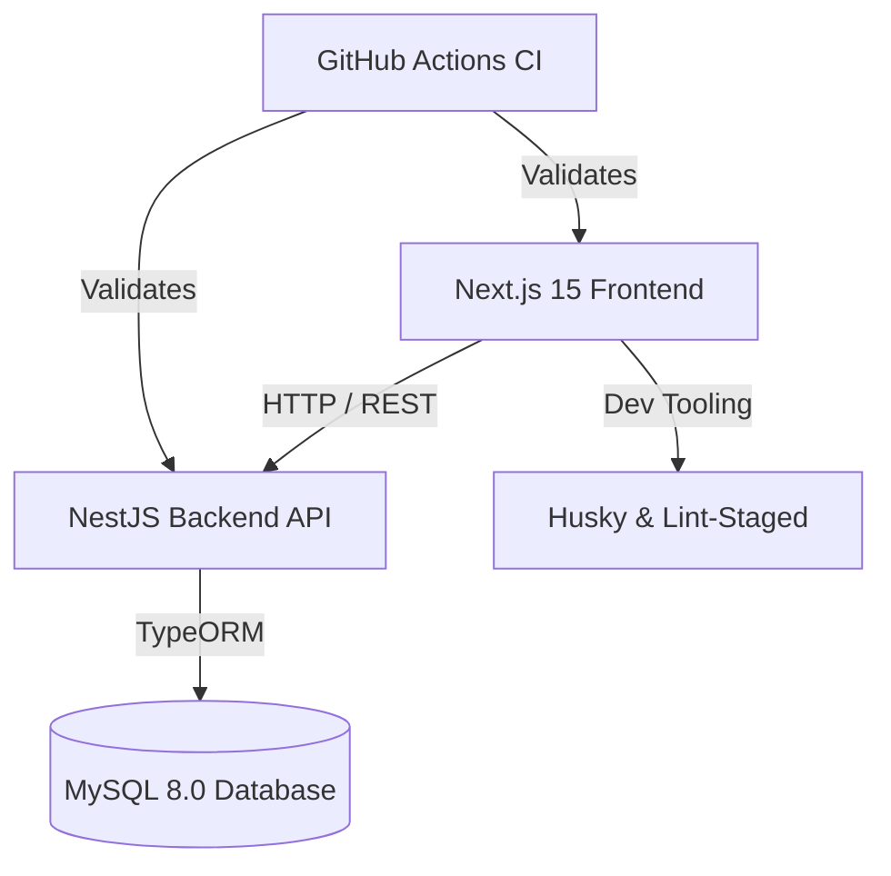
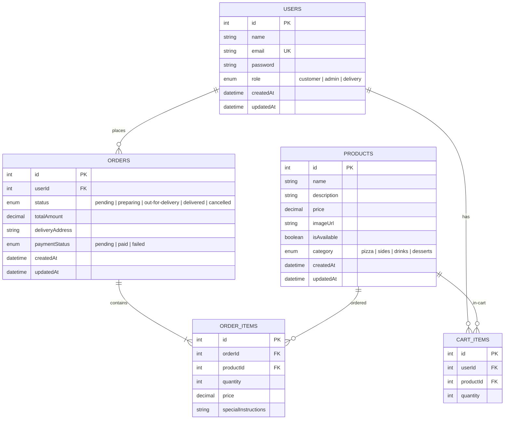

# Pizza Hut Inspired Food Ordering Platform - Architecture & Workspace Setup

This repository contains the architecture, tooling, and foundation for a production-grade, full-stack food ordering platform built with **Next.js 15**, **NestJS**, **MySQL**, **TypeORM**, and **Docker Compose**.

## 1. System Architecture

The platform follows a decoupled client-server architecture with the following system design:



### Components:

1. **Frontend (Next.js 15)**: Leverages React 19, TailwindCSS, Shadcn UI, and React App Router. Integrates Axios for client-side queries, and uses state management to orchestrate shopping carts, checkout, and authentication sessions.
2. **Backend (NestJS)**: Restructures routing via modular containers (`AuthModule`, `UsersModule`, `ProductsModule`, `OrdersModule`). Features strict TypeScript typing, validation pipes, global exception filters, and interactive Swagger OpenAPI documentation.
3. **Database (MySQL 8)**: Hosted in Docker Compose, utilizing TypeORM migrations and entities for schema syncing and relationship enforcement.
4. **DevOps & Tooling**: Configured with Prettier, ESLint, Husky git pre-commit hook checks, and GitHub Actions continuous integration testing.

---

## 2. Authentication Architecture

The application enforces state-of-the-art authentication:

- **Authentication Flow**:
  1. A user submits credentials to `POST /api/auth/login`.
  2. The server authenticates credentials (using `bcrypt` for password checks) and generates a JWT.
  3. The JWT contains basic payload information (`userId`, `email`, `role`).
  4. The client stores the JWT securely and attaches it via HTTP `Authorization: Bearer <token>` headers inside client-side request interceptors.
- **Role-Based Access Control (RBAC)**:
  - Users are assigned roles: `customer`, `admin`, or `delivery`.
  - Roles are enforced on the backend via NestJS Route Guards (`RolesGuard`) using custom decorator definitions.
  - Next.js middleware restricts dashboard routes (`/admin/*`) based on decoded token states.

---

## 3. Database Schema

The database model is mapped via TypeORM:



---

## 4. Workspace & Folder Structure

```
food-ordering-platform/
├── backend/                   # NestJS Server Application
│   ├── src/
│   │   ├── config/            # Env config settings & Joi validation schemas
│   │   ├── database/          # TypeORM database initialization module
│   │   ├── modules/
│   │   │   ├── auth/          # Authentication flows (login, signup, JWT)
│   │   │   ├── users/         # Users entity & storage module
│   │   │   ├── products/      # Pizza and item catalogs
│   │   │   └── orders/        # Order and checkout management
│   │   └── main.ts            # Entrypoint (pipes, CORS, prefix, Swagger docs)
│   └── package.json
├── frontend/                  # Next.js 15 Client Application
│   ├── src/
│   │   ├── app/               # Page routing nodes (App Router)
│   │   ├── components/        # Tailwind Components & Shadcn UI elements
│   │   ├── hooks/             # Custom utility React hooks
│   │   ├── lib/               # Utility scripts & HTTP/Axios instance
│   │   ├── store/             # Zustand cart & user contexts
│   │   └── types/             # Common TS type contracts
│   └── package.json
├── .github/
│   └── workflows/
│       └── ci.yml             # Automated CI pipeline
├── docker-compose.yml         # Database infrastructure (MySQL & Adminer)
└── package.json               # Monorepo task runner & Husky configurations
```

---

## 5. Development Quickstart

### Prerequisites

- Node.js (v20+)
- npm (v10+)
- Docker & Docker Compose

### Step 1: Clone and Install Dependencies

Install dependencies at the workspace root (this will install dependencies for the root, frontend, and backend packages):

```bash
npm install
```

### Step 2: Start the Database Container

Run the following command to boot the MySQL database and Adminer web interfaces:

```bash
docker compose up -d
```

- **MySQL Address**: `localhost:3306`
- **Adminer Portal**: `http://localhost:8080` (use Database: `food_platform`, Username: `dbuser`, Password: `dbpassword`)

### Step 3: Set Environment Configurations

Configure target `.env` files in both the frontend and backend directories (examples are provided inside their respective folders).

### Step 4: Run Applications in Development Mode

To boot both applications in parallel, run:

- Backend server: `npm run dev:backend` (runs on `http://localhost:4000`)
- Frontend client: `npm run dev:frontend` (runs on `http://localhost:3000`)
- Swagger Documentation: Available at `http://localhost:4000/api/docs`

---

## 6. Git Commit Hook & Coding Standards

- Commit checks are governed by **Husky** and **lint-staged**.
- Any commit automatically triggers Prettier formatting checks and ESLint repairs across modified TypeScript files.
- The pipeline will reject commits containing code style violations or syntax/type compilation issues.
